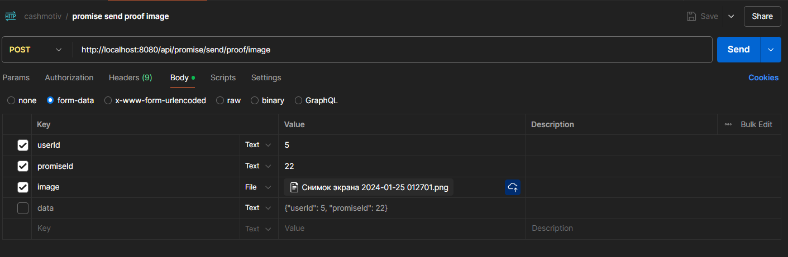

# Документация

---

## REST документация

### Регистрация
    url: /api/user/register
    method: POST
    body: {
        login: String,
        email: String
        password: String
    }

    Регистрирует пользователя по уникальному login и email,
    password должен соответствовать паттерну пароля, так же
    отправляет письмо с уникальным токеном на почту, если 
    письмо не пришло при помощи "Отправить письмо верификации снова"
    можно отправить письмо с токеном занова, генерируется новый токен,
    если токен будет просрочен и юзер не верефицирует почту(себя заодно),
    то они будут удалены, возвращает User

### Изменение персоналной информации
    url: /api/user/change/personal/info
    method: PATCH
    body: {
        userId: Long,
        name: String,
        surname: String,
        hash: String
    }

    Изменение персональной информации(имя + фамилия) в настройках

### Изменение пароля
    url: /api/user/change/password
    method: PATCH
    body: {
        userId: Long,
        oldPassword: String,
        newPassword: String,
        hash: String
    }

    Изменяет пароль в настройках, oldPassword - старый пароль, 
    newPassword - новый пароль, должен соответствовать паттерну пароля,
    возвращает user 

### Забыли пароль
    url: /api/user/forgot/password
    method: POST
    body: {
        loginOrEmail: String
    }

    Возвращает заблюреный email в случае успеха и
    присылает на него письмо, если токен уже существует,
    то переделает его, т оесть можно жамкать много раз
    подряд

### Проверка токена пароля на существование
    url: /api/user/check/forgot/password/token
    method: GET
    request params: {
        token: String
    }

    Проверяет существует ли токен смены пароля token,
    если да, то возвращает true, иначе NOT FOUND 404

### Смена забытого пароля
    url: /api/user/change/forgotten/password
    method: POST
    body: {
        token: String,
        newPassword: String
    }

    Нужен для того чтоб после перехода по ссылке из
    письма поменять пароль, в ссылке будет token, 
    newPassword должен соовествовать паттерну пароля,
    возвращает User, то есть можно сразу войти

### Отправить письмо верификации снова
    url: /api/user/send/verify/email/again
    method: POST
    body: {
        email: String
    }

    Отправляет на указаный адресс(email) письмо с новым токеном
    верификации, работает как для того чтоб присылать новое письмо
    при верификации, так и при добавлении новой почты, елси токен будет просрочен, 
    то email будет удален, если это главный email, то user тоже будет удален,
    возвращае тemail(сущность из бд)

### Верификация почты
    url: /api/email/verify
    method: GET
    request params: {
        token: String
    }

    Нужно для верификации почты(или юзера) по токену, ссылка на это есть
    в письме, возвращает "Email verified" в случае успеха

### Добавление новой почты
    url: /api/email/add/new
    method: POST
    body: {
        userId: Long,
        email: String,
        hash: String
    }

    Добавляет новую почту и присылает письмо верификации на почту, 
    если токен верификации будет просрочен, то удалит почту, письмо
    можно прислать снова при помощи "Отправить письмо верификации снова",
    в этом случае будет сгенерирован новый токен, возвращает email(сущность из бд)

### Смена главной почты
    url: /api/email/change/main/email
    method: PATCH
    body: {
        userId: Long,
        email: String,
        hash: String
    }

    Делает верифифированную почту(email, верификация проверяется на сервере)
    основной, возвращает email(сущность из бд)

### Изменение статуса уведомлений
    url: /api/email/change/notification
    method: PATCH
    body: {
        userId: Long,
        notification: Boolean,
        hash: String
    }

    Ставит состояние призода уведомлений у пользователя
    пользователя на значение notification, уведомления в случае 
    notification = true будут приходить на основную почту, 
    возвращает user

### Удаление почты
    url: /api/email/delete/email
    method: DELETE
    body: {
        userId: Long,
        email: String,
        hash: String
    }

    Удаляет email пользоваателя если он не основной, 
    возвращает true при успехе

### Создание jwt токена(вход)
    url: /api/jwt/create
    method: POST
    body: {
        loginOrEmail: String,
        password: String
    }

    Сохдает jwt токен для пользователя по его (почте или логину) 
    и паролю, возвращает jwt

### Найти jwt(вход автаматический)
    url: /api/jwt/find
    method: GET
    request params: {
        jwt: String
    }

    Находит пользователя по токену для автаматического вохода,
    возвращает user

### Подписаться на рассылку
    url: /api/mailing/subscribe
    method: POST
    body: {
        email: String
    }

    Пожписывает указанную почту на рассылку, данная почта
    никак не связана с пользователем, так что можно подписываться
    как залогиненному, так и не залогиненному пользователю, данный 
    параметр никак не хранится у пользователя(user) так что выводить
    этот параметр никак невозможно на сайте, разве что только
    при его инициализации, возвращает mailingEmail

### Отписка от рассылки
    url: /api/mailing/unsubscribe
    method: GET
    request params: {
        token: String
    }

    По ссылке из почты в любом письме рассылки отписывается 
    от рассылки по уникальному токену для каждой почты, при
    этом удаляет данную почту из бд, в случае успеха возвращает
    "Sucess"
### Создать обещание
    url: /api/promise/create
    method: POST
    body: {
        userId: Long,
        title: String,
        description: String,
        deadline: DATE (2025-27-12T23:59:59.999+00:00),
        type: String (IMAGE|NOTICE),
        notification: Boolean,
        notificationTime: DATE (2025-27-12T23:59:59.999+00:00, может быть null),
        hash: String
    }

    Создание обещания для пользователя с id=userId, 
    notificationTime - время отпраки напоминания на почту,
    ессли данный параметр не указать он будет выбран автоматически.
    Создавать обещание можно с дедлайном не раньше чем через 2 часа.
    Вернет promise

### Отправить пруф для обещания типа Notice
    url: /api/promise/send/proof/notice
    method: POST
    body: {
        userId: Long,
        promiseId: Long,
        hash: String
    }

    Пользователь отправляет что он выполнил обещание
    типа Notice (то есть просто поставил галочку).
    Возвращает promise, ВАЖНО пока что может быть
    такая ситуация что обещание уже просрочено, но пользователю
    показывается что оно все еще в прогрессе,
    (хотя данная ситуация возможна даже после того как я допилю функцию
    которая чекает все невыполненные обещания пользователя на просроченность
    при переходе на страничку с промисами, хотя даже в таком случае можно
    поймать тайминг что тебе показывается что обещание в процессе, а на самом деле оно
    уже просрочено, думаю на фронте надо реализовать таймер у каждого обезания
    и блочить отправку, на сервере все равно потом все подтянется), тогда в этом 
    слуае функция вернет promise но он будет со status=FAILED'

### Закрыть обещание
    url: /api/promise/close
    method: POST
    body: {
        userId: Long,
        promiseId: Long,
        hash: String
    }

    Закрывает обещание, на закрытие обещания дается 
    10 минут с момента его создания, после закрытия 
    его статус будет CLOSED, возвращает promise 

### Найти обещание по Id
    url: /api/promise/get
    method: POST
    body: {
        userId: Long,
        promiseId: Long,
        hash: String
    }

    Находит promise по его Id и возвращает его

### Найти страницу с обещаниями
    url: /api/promise/get/page
    method: POST
    body: {
        userId: Long,
        pageNum: Integer (от 0),
        pageSize: Integer,
        noticeEnabled: Boolean,
        imageEnabled: Boolean,
        inProgressEnabled: Boolean,
        underReviewEnabled: Boolean,
        verifiedEnabled: Boolean,
        failedEnabled: Boolean,
        closedEnabled: Boolean,
        sortBy: Sting (CREATION_DATE|EXPIRATION_DATE) не обязательный параметр,
        sortDirection: String (ASC|DESC) не обязательный параметр,
        hash: String
    }

    Метод который нужен для отображения нескольких обещаний
    на одной странице, объяснение тела запроса
    
    База:
    userId: тут все понятно
    pageNum: номер страницы
    pageSize: размер страницы
    
    Тип обещания (фильтр):
    noticeEnabled: если true будут показываться обещания
        типа NOTICE
    imageEnabled: если true будут показываться обещания
        типа IMAGE

    Статус обещания(фильтр):
    inProgressEnabled: если true, то будут показываться
        обещания которые в процессе выполнения
    underReviewEnabled: если trur, то будут показываться
        обещания которые на ревью, например картвнки
    verifiedEnabled: если true, то будут показываться
        обещания, которые выполнены, то если либо после
        ревью, либо галочку поставили если тип NOTICE
    failedEnabled: если true, то будут показыаться зафейленные
        обещания
    closedEnabled: если true, то будут показываться закрытые
        обещания, то есть те которые отмениле через максимум
        10 минут после создания
    
    Сортировка:
    sortBy: сортирует либо по дате когда было создано обещание,
        либо по дате когда его дедлайн, елси не указать или указать
        неправильную строку, то будет обычная сортировка по id от самых
        новых
    sortDirection: порядок сортировки, если не указан или ошибочно
        указан sortBy, то ни на что не влияет, а так все по базе SQL

    возвращает Page<promise>

### Отправить пруф для обещания типа Image (загрузить картинку)
    url: /api/promise/send/proof/image
    method: POST
    model attribute: {
        userId: Long,
        promiseId: Long
        image: some image,
        hash: String
    }
    Загружает пруф для обещания типа Image,
    возвращает promise, ниже подсказка как это вызывать
    
    разрешенные типы изображений(возможно будет редактироваться):
        jpg,
        jpeg,
        png,
        gif,
        webp
    важно что content type долен быть image/type где 
    type это один из разрешенных типов

---

## Документация ответов

### user
    id: Long,
    name: String,
    surname: String,
    login: String,
    mainEmail: email,
    notificationsEnabled: Boolean,
    mainEmailIsVerified: Boolean,
    creationTime: Date,
    emails: List<email>

### email
    id: Long,
    email: String,
    isMain: Boolean,
    isVerified: Boolean,
    creationTime: Date

### jwt
    jwt: String

### mailingEmail
    id: Long,
    email: String
    unsubscribeToken: String
    creationTime: Date
    

### promise
    id: Long,
    title: String,
    description: String,
    type: String (NOTICE|IMAGE),
    proof: String,
    status: String (IN_PROGRESS|
                    UNDER_REVIEW|
                    VERIFIED|
                    FAILED|
                    CLOSED
    ),
    expiryDate: Date,
    creationTime: Date,
    userId: Long

### Page<X>
    content: List<X>,
    totalElements: Integer,
    totalPages: Integer,
    numberOfElements: Integer

    и есть еще параметы, ниже пример Page<promise>
    
    {
        "content": [
            {
                "id": 7,
                "title": "Test promise",
                "description": "Test promise ОПИСАНИЕ 122345!!!??:::^^^%%% да тут вообще что угодно может быть, норм",
                "type": "IMAGE",
                "proof": null,
                "status": "FAILED",
                "expiryDate": "2025-04-17T22:30:30.000+00:00",
                "creationTime": "2025-04-15T21:13:49.309+00:00",
                "userId": 5
            },
            {
                "id": 6,
                "title": "Test promise",
                "description": "Test promise ОПИСАНИЕ 122345!!!??:::^^^%%% да тут вообще что угодно может быть, норм",
                "type": "NOTICE",
                "proof": null,
                "status": "FAILED",
                "expiryDate": "2025-04-17T22:30:30.000+00:00",
                "creationTime": "2025-04-15T21:13:48.591+00:00",
                "userId": 5
            }
        ],
        "pageable": {
            "pageNumber": 0,
            "pageSize": 2,
            "sort": {
                "empty": true,
                "sorted": false,
                "unsorted": true
            },
            "offset": 0,
            "paged": true,
            "unpaged": false
        },
        "last": false,
        "totalElements": 7,
        "totalPages": 4,
        "size": 2,
        "number": 0,
        "sort": {
            "empty": true,
            "sorted": false,
            "unsorted": true
        },
        "first": true,
        "numberOfElements": 2,
        "empty": false
    }